# Battle City: Learning Python with Game Programming

Learning a programming language could be challenging and sometimes, 
could be boring. Hence, to keep things interested while learning python,
I tried to learn about syntax, rules, along object orient programming with
an attempt of recreating my own version of the classic NES game.

## Installation

All the required dependencies can be installed with the [requirements.txt](requirements.txt).
```python 
$ pip install -r requirements.txt
```
Game is launched by executing the following:
```python 
$ python main.py
```

## Lessons Learned

In addition to the basics of python programming (the use of functions, classes,
loops, file access), I have been learning to develop the following concepts
in this project.
- Integrating basics of dynamic and physics rules (motion and collision 
depending on the type of the objects that interact with one another)
- Basic implementation of game mechanics in terms of allowing user configurations,
adopting the notion of stages and their advancement, modeling arbitrary 
behaviors for the enemies.


## Game Structure

The game is a grid world composed with multiple objects that has to be interacting 
with one another. The interactions take place between human users and computer
generated enemies over several rounds, each is termed as stages. The goal of
the users to clear the stage and advance while preventing the game to be failed.

### Tank

_Definition: [Tank(pg.sprite.Sprite)](objectClasses.py#L52)_

This is the main game object. The user can control two tanks (**players**) while the 
computer opponent generates 20 tanks (**enemies**) within a stage. All tanks can move in four
The players can pick [power-up items](#power-ups) that are spawned upon attacking 
a special type of enemies that have red flashes.
These power-ups could provide several advantages including 
leveling up mechanism.

Tanks have four levels. By picking up [Star](#star), players can level up (visual 
update as well as boosts for mobility and shooting) while getting a 
hit result in a single level down or a kill with level 0.

| Level |                Player 1                   |                 Player 2                  |                          Enemy                           | Movement speed | Shooting speed |
|:-----:|:-----------------------------------------:|:-----------------------------------------:|:--------------------------------------------------------:|:--------------:|:--------------:|
|   0   | 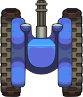 | 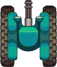 |   |      100%      |      100%      |
|   1   | 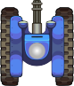 | 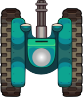 |   |      105%      |      133%      |
|   2   | 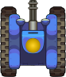 | 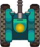 |   |      111%      |      150%      |
|   3   | 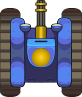 | 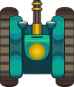 |   |      118%      |      160%      |

Tanks collide with all the objects except the blocks [Ice](#ice)
and [Forest](#forest). A collision with a **Bullet** from the opposing party
result in a level down or a kill if the tank is level 0. The kill results in
an explosion and for players, it is respawned if they have remaining lives.


### Win and Loss Conditions

The goal of the players is to destroy all enemies and advance to next stage
while protecting the bird .
However, the game could be failed if enemies managed to kill out both players
until no more of lives or the bird is destroyed.

### Game Modes

The game has two modes (easy or difficult) for both players and enemies.

With _easy player_ mode, players always start with fully upgraded tanks and 
have 9 lives. In _difficult player_ mode, the tanks are staring with level 0 and
the number of lives are 3.

Under enemy category, _easy_ mode generates enemies that has no preference on the
direction of movements and delay between new enemies to appear if the enemy
count drops below 6 is 10s. In the _difficult_ mode, tanks have a slight bias to
move towards the bird and new enemies spawn within 3s.

### Obstacles
_Definition: [Obstacle(pg.sprite.Sprite)](objectClasses.py#L493)_

The environment is composed of several other obstacle objects.
Note that obstacles are not necessarily reflecting the items that prevent
movements.

#### Brick 
Bricks are obstacles that prevent tanks' mobility.
However, they can be destroyed by shooting at them.
Upon a bullet hit, a half of the block can be destroyed at once. 

#### Forest 
Forests offer certain camouflage. Tanks and bullets can 
go through (more likely beneath) forests.

#### Ice 
A terrain type that results tanks to move faster (slide).
On the ice patches, tanks gain 200% boost on top of their current speed.


#### Ocean 
These represent body of water. Tanks cannot move over the water,
but the bullets can fly over them.

#### Steel 
Steels are unbreakable obstacles. Neither tanks nor
bullets can penetrate.


### Power-ups
_Definition: [class Reward(pg.sprite.Sprite)](objectClasses.py#757)_

Power-ups are collectible items that grant different rewards to players.
They drop in a random location when special enemies get shot.
If not collected, the power-ups disappear after 15s.  

#### Bomb 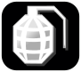 _(20% drop probability)_
When a player picks up a bomb, all enemies on the map get damaged
equivalent to a hit by a single bullet.

#### Clock  _(20% drop probability)_
By collecting a clock, players can freeze current enemies 
for a duration of 10s. The frozen enemies do not move nor shoot.
Newly spawned enemies are not affected.

#### Hat  _(20% drop probability)_
Hat grants a shield to the player who collects it for a duration of 
10s. The shield is visible by an oscillating aura around the tank.

#### Life  _(5% drop probability)_
Life grants an extra life to the player who collects it.
A player can have at most of 10 lives.

#### Shovel  _(20% drop probability)_
Shovel fortifies the bird by adding a steel wall around the bird for
15s. After 15s, the steel wall is transformed back into a brick wall.

#### Star  _(15% drop probability)_
Upon picking up a star, player can level up itself, which granting boosts
on mobility and shooting. 


## Game Play

### Welcome Screen
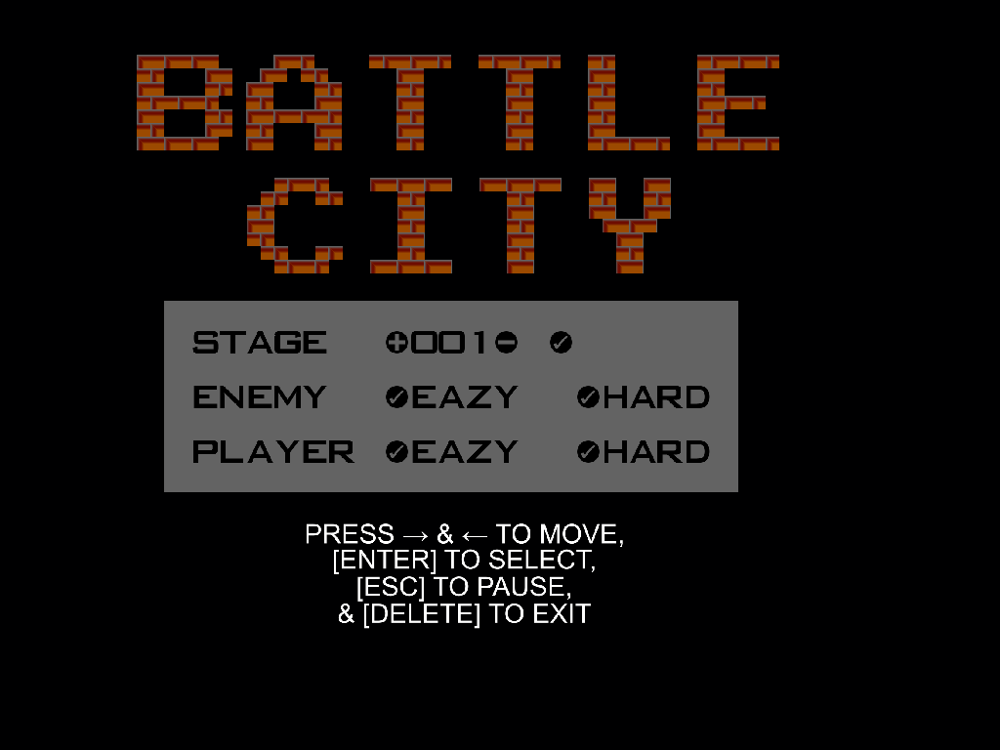

This allows users to decide the following:

- **Stage**: The number of starting stage. Currently, it is from 001 to 035. However,
adding more maps with current naming convention will allow higher number of
stages up to 999. 
- **Enemy difficulty**: See [Game Modes](Game Modes).
- **Player difficulty**: See [Game Modes](Game Modes).

The keys to navigate are shown on the screen.

### Stages
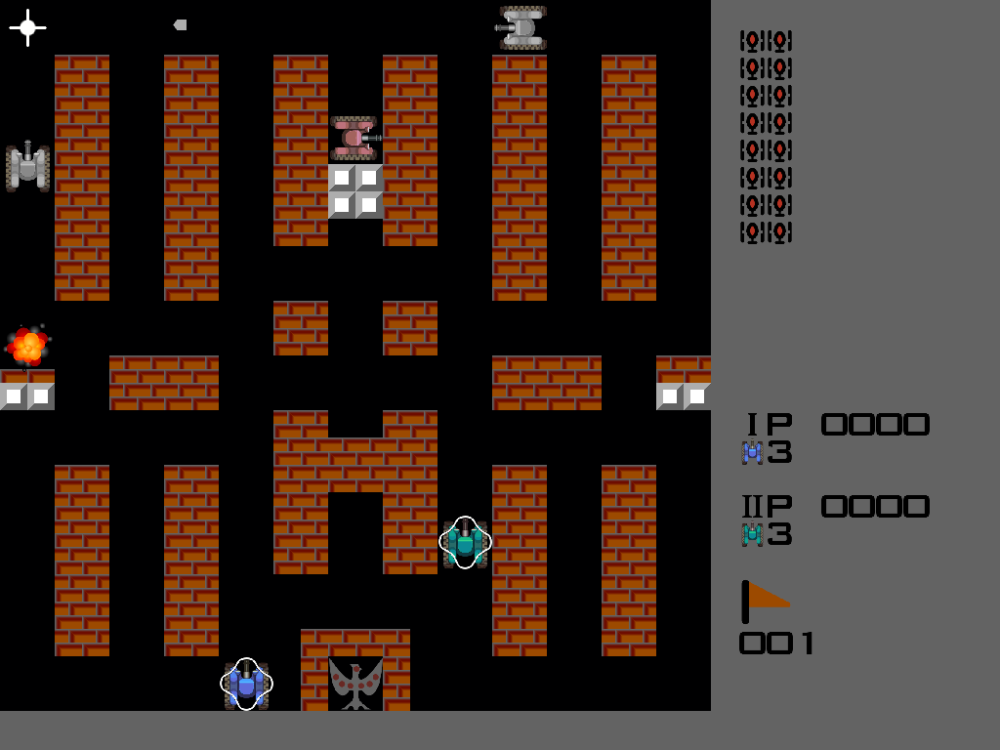

There are altogether 35 stages corresponding to classical Battle City game. See the blueprints 
of the stages under Gallery section in [here](https://strategywiki.org/wiki/Battle_City/Walkthrough).

In each stage, players spawn on the bottom and enemies on the top.
Game area is a square are to the left.
At the top of the right side, tanks icons show the remaining number of enemies.
Below them, the score and the remaining lives for each player is shown.
At the bottom, the stage number is indicated.

### User Controllers
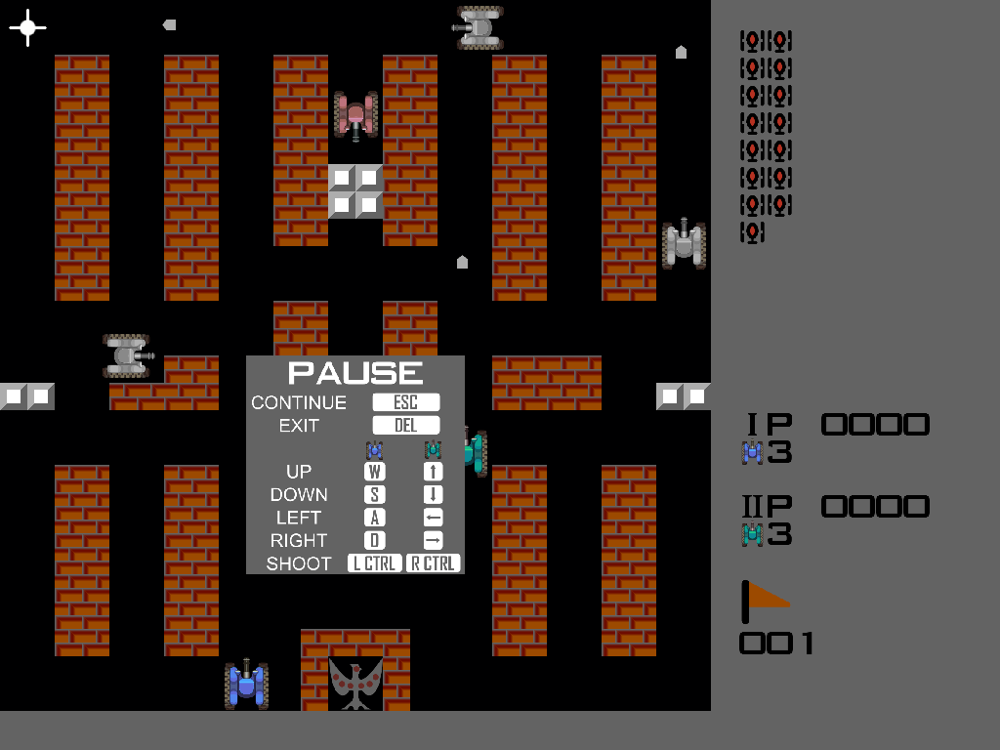

The _Pause_ menu is popped by pressing `ESCAPE` key. All key configurations are 
shown below.

#### General controls

|    Option     |   Key    |
|:-------------:|:--------:|
| Pause/Unpause | `ESCAPE` |
|     Exit      |  `DEL`   |

#### Game controls

| Command | Player 1  |  Player 2   |
|:-------:|:---------:|:-----------:|
|   Up    |     W     |  Up arrow   |
|  Down   |     S     | Down arrow  |
|  Left   |     A     | Left arrow  |
|  Right  |     D     | Right arrow |
|  Shoot  | Left CTRL | Right CTRL  |


## Other configurations

### Map Builder
The maps are created as _xyz.map_ files numbered in the sequential order.
All maps appear under [maps](maps) folder. In runtime, [map_builder.py](map_builder.py)
loads and generate the maps.

> **_NOTE:_**  The maps files need to be numbered sequentially with 
> three characters to avoid possible runtime errors.

Custom maps can be generated with the aforementioned naming convention and using
the following guidelines.

- First 13 lines of the file corresponds to the content to be drawn in 13 rows,
from top to the bottom. Each row has 13 blocks of two-character terms separated 
by spaces. These characters represent the object in the specific location.
Each location is a 2-by-2 space.
  - 00: empty block
  - b0 to b8: bricks
  - s0 to s8: steels
  - o0: Ocean
  - f0: Forest
  - i0: Ice
  - Second digit is used to define different shapes to fill the 2-by-2 block in 
  the following order.
  
| 0 | 1 | 2 | 3 | 4   | 5   | 6 | 7 | 8 |
|---|---|---|---|-----|-----|---|---|---|
| ▉ | ▍ | ▃ |  ▐ | ▀  |  ▘  | ▖ | ▗ | ▝ |

- The locations for placing the bird and tank spawning are automatically
replaced by empty or bird objects.
- Line 15 has 20 digits separated by spaces. These represent the levels
of 20 enemies in their spawning order.
  - Levels are from 0 to 3 (see [levels](Tank))

### Custom Settings [To Do]

#### Number of Players
The user can decide whether the game is played as a single player setting or 
two-player coop missions.

#### Mapping of The Keys
This is to provide user(s) to remap the control keys rather than modifying it
from the code.

#### Change Resolution 
This is to enable user(s) to select a resolution that fits to their display 
setup.

### Hall of Fame [To Do]
Allow users to showcase the highest scores along with their names.

## Known Issues

- The application terminates as the game ends. For a new round of play,
the game needs to be run as a new instance. 
- Though it is not tested thoroughly, the latest version of pygame may result in some errors,
in which, it is advised to use the older version used during the development.
- In some cases bullets can pass through a single layer of brick walls
and thus, could cause game to fail.
- Scoring beyond 9999 results in visual glitches.

## Resources

* **Sprites**: Created using Inkscape following the structure of 
https://www.spriters-resource.com/nes/batcity/sheet/60016/ and the 
sprite sheet can be found in [here](res/tank_res_high.png).

* **Sounds**: https://www.sounds-resource.com/nes/battlecity/sound/3710/
